```
    __  ___    ________                      __       ____                      __                      __  _     
   / / / (_)  /_  __/ /_  ___  ________     / /      /  _/  ____ _____ ___     / /   __  ______  ____ _/ /_(_)____
  / /_/ / /    / / / __ \/ _ \/ ___/ _ \   / /       / /   / __ `/ __ `__ \   / /   / / / / __ \/ __ `/ __/ / ___/
 / __  / /    / / / / / /  __/ /  /  __/  /_/      _/ /   / /_/ / / / / / /  / /___/ /_/ / / / / /_/ / /_/ / /__  
/_/ /_/_/    /_/ /_/ /_/\___/_/   \___/  (_)      /___/   \__,_/_/ /_/ /_/  /_____/\__,_/_/ /_/\__,_/\__/_/\___/  
                                                                                                                  
```



## My Preferred Operating Systems
<div align="center">
  
</div>


## Skill Set Overview

<div align="center">
  
</div>

<div align="center">
  
</div>

<br/>

## Visitor Statistics
<div align="center">

</div>  


## Recent Posts on My [Blog](https://goodlunatic.github.io/)
<!-- BLOG-POST-LIST:START -->
- [2025-07-05 00:00:36 如何给Wireshark添加LTE和NR支持](https://goodlunatic.github.io/posts/4c7a04a/)
- [2025-05-28 10:29:38 强网杯-谍影重重系列赛题详解](https://goodlunatic.github.io/posts/1a152f0/)
- [2025-05-17 00:33:26 Frida Learning Record](https://goodlunatic.github.io/posts/ca974cb/)
- [2025-05-15 10:15:27 Misc-Network Traffic Analysis](https://goodlunatic.github.io/posts/5422d65/)
- [2025-05-09 21:10:26 DASCTF 2024最后一战 Misc Writeup](https://goodlunatic.github.io/posts/32c3b27/)
- [2025-05-02 11:30:17 CTF-Misc Guide](https://goodlunatic.github.io/posts/1ad9200/)
- [2025-05-02 10:39:58 CTF-Misc &quot;雅&quot;题共赏](https://goodlunatic.github.io/posts/d0736a7/)
- [2025-04-23 14:12:43 Qualcomm高通 诊断日志分析工具的安装及使用](https://goodlunatic.github.io/posts/95cea53/)
- [2025-04-23 10:51:27 C/C++程序开发学习记录](https://goodlunatic.github.io/posts/e393438/)
- [2025-04-21 18:50:35 2025 能源网络安全大赛 Misc Writeup](https://goodlunatic.github.io/posts/87bd986/)<!-- BLOG-POST-LIST:END -->
