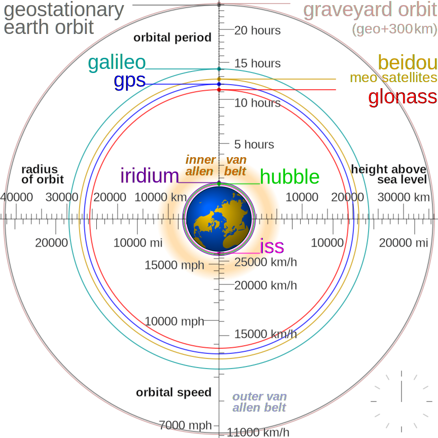

```
    __  ___    ________                      __       ____                      __                      __  _     
   / / / (_)  /_  __/ /_  ___  ________     / /      /  _/  ____ _____ ___     / /   __  ______  ____ _/ /_(_)____
  / /_/ / /    / / / __ \/ _ \/ ___/ _ \   / /       / /   / __ `/ __ `__ \   / /   / / / / __ \/ __ `/ __/ / ___/
 / __  / /    / / / / / /  __/ /  /  __/  /_/      _/ /   / /_/ / / / / / /  / /___/ /_/ / / / / /_/ / /_/ / /__  
/_/ /_/_/    /_/ /_/ /_/\___/_/   \___/  (_)      /___/   \__,_/_/ /_/ /_/  /_____/\__,_/_/ /_/\__,_/\__/_/\___/  
                                                                                                                  
```
<div align="center">

</div>

## My Preferred Operating Systems
<div align="center">
  
</div>


## Skill Set Overview

<div align="center">
  
</div>

<div align="center">
  
</div>

<br/>

## Visitor Statistics
<div align="center">

</div>  


## Recent Posts on My [Blog](https://goodlunatic.github.io/)
<!-- BLOG-POST-LIST:START -->
- [2026-04-24 09:15:38 CTF-逆向工程](https://goodlunatic.github.io/posts/0f92e23/)
- [2026-04-11 10:07:14 AI相关内容的学习](https://goodlunatic.github.io/posts/50888d4/)
- [2026-04-08 09:10:58 CTF-Misc &quot;雅&quot;题共赏](https://goodlunatic.github.io/posts/d0736a7/)
- [2026-04-01 09:20:11 星球朋友们问的一些来路不明的题](https://goodlunatic.github.io/posts/bb1da35/)
- [2026-04-01 09:10:17 [持续更新] CTF-Misc Guide](https://goodlunatic.github.io/posts/1ad9200/)
- [2026-03-30 09:37:04 2026 楚慧杯湖北省网络与数据安全实践能力竞赛 Misc Writeup](https://goodlunatic.github.io/posts/59dcb62/)
- [2026-01-15 21:46:22 CTF-Reverse刷题记录](https://goodlunatic.github.io/posts/b7a1d1b/)
- [2026-01-12 10:22:38 [持续更新] 记录各种app关闭广告和推荐的方法](https://goodlunatic.github.io/posts/911b6a0/)
- [2026-01-10 21:53:27 2025 鹏城杯联邦网络靶场协同攻防演练 Misc Writeup](https://goodlunatic.github.io/posts/8bf5633/)
- [2026-01-05 22:21:03 2025 年终总结](https://goodlunatic.github.io/posts/6cc9a96/)<!-- BLOG-POST-LIST:END -->
